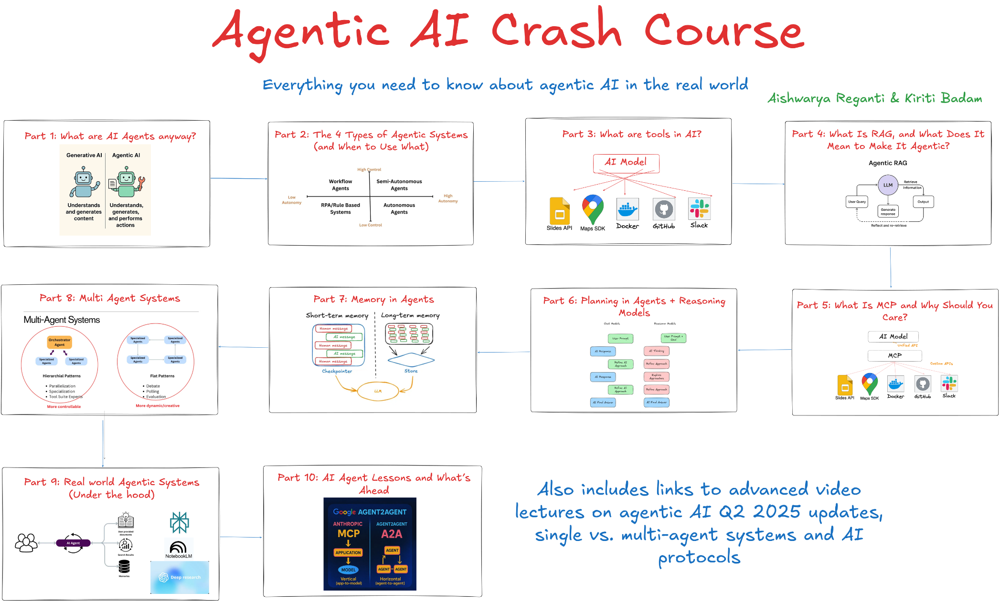

# Cours Intensif sur l'IA Agentique

**Tout ce que vous devez savoir sur l'IA agentique dans le monde réel**

*Créé initialement par [Aishwarya Reganti](https://www.linkedin.com/in/areganti/) & [Kiriti Badam](https://www.linkedin.com/in/sai-kiriti-badam/) , deux Top voices du monde de l'IA, ce cours vise à être simple, utile et une porte d'entrée au sujet de l'IA Agentique.*

---
## 📚 Parties du cours

### [Partie 1 : C'est quoi les agents IA ?](./part1_what_are_ai_agents_anyway.md)
Comprendre les différences fondamentales entre l'IA générative et l'IA agentique, les capacités essentielles et les applications concrètes.

### [Partie 2 : Les 4 types de systèmes agentiques (et quand utiliser lequel)](./part2_the_4_types_of_agentic_systems.md)
Explorez les agents à flux de travail, les agents semi-autonomes, les systèmes basés sur des règles et les agents autonomes avec des cadres de décision.

### [Partie 3 : C'est quoi les outils en IA ?](./part3_what_are_tools_in_ai.md)
Découvrez l'intégration des modèles IA, les connexions API, les écosystèmes d'outils et le développement d'outils personnalisés.

### [Partie 4 : C'est quoi le RAG et qu'est-ce que ça signifie de le rendre agentique ?](./part4_what_is_rag_and_agentic.md)
Plongée en profondeur dans la Génération Augmentée par Récupération, le RAG traditionnel vs agentique et les patterns d'implémentation.

### [Partie 5 : C'est quoi le MCP et pourquoi s'y intéresser ?](./part5_what_is_mcp_and_why_care.md)
Comprendre le protocole de contexte de modèle, les stratégies d'intégration des modèles IA et la mise en œuvre en entreprise.

### [Partie 6 : La planification dans les agents + les modèles de raisonnement](./part6_planning_in_agents_reasoning_models.md)
Stratégies de planification des agents, intégration des modèles de raisonnement et capacités de raisonnement avancées.

### [Partie 7 : La mémoire dans les agents](./part7_memory_in_agents.md)
Systèmes de mémoire à court et long terme, patterns d'architecture et optimisation des performances.

### [Partie 8 : Les systèmes multi-agents](./part8_multi_agent_systems.md)
Architecture multi-agents, patterns hiérarchiques, stratégies de coordination et considérations de scalabilité.

### [Partie 9 : Les systèmes agentiques en conditions réelles (sous le capot)](./part9_real_world_agentic_systems.md)
Études de cas de systèmes en production, patterns d'architecture et enseignements tirés d'implémentations en entreprise.

### [Partie 10 : Leçons sur les agents IA et perspectives](./part10_ai_agent_lessons_whats_ahead.md)
Derniers développements, tendances futures, feuille de route du secteur et technologies émergentes dans l'IA agentique.

---

## 🎥 Conférences vidéo avancées

### Conception de systèmes et applications

- [Maîtriser la conception de systèmes d'IA générative](https://maven.com/p/8c3221/master-generative-ai-system-design)
- [Pourquoi les agents IA ne suffisent pas pour les applications réelles](https://maven.com/p/20f0ed/why-ai-agents-aren-t-enough-for-real-world-applications)
- [Concevoir des applications IA agentiques pour des cas d'usage en entreprise](https://maven.com/p/497d05/designing-agentic-ai-applications-for-enterprise-use-cases)
- [Développer des applications IA agentiques en 2025](https://maven.com/p/82345a/building-agentic-ai-applications-in-2025)
- [Évaluer les applications IA agentiques : au-delà des vérifications intuitives](https://maven.com/p/6f0e97/evaluating-agentic-ai-applications-beyond-vibe-checks)

### Produit et mise en œuvre en entreprise

- [Produits natifs en IA : ce que chaque chef de produit doit savoir et faire](https://maven.com/p/9a34b0/ai-native-products-what-every-pm-needs-to-know-and-do)
- [Concevoir des systèmes IA agentiques pour l'entreprise - Partie 1](https://maven.com/p/466e22/1-designing-agentic-ai-systems-for-enterprise-use-cases)
- [Concevoir des systèmes IA agentiques pour l'entreprise - Partie 2](https://maven.com/p/a0cdf1/2-designing-agentic-ai-systems-for-enterprise-use-cases)

### Sujets avancés et mises à jour T2 2025

- [Développer des applications IA agentiques : mises à jour T2 2025 - Partie 1](https://maven.com/p/b8470c/1-building-agentic-ai-applications-2025-q2-updates)
- [Les protocoles IA 101 : ce que vous devez savoir sur MCP, A2A, etc.](https://maven.com/p/e2b5db/2-ai-protocols-101-what-you-should-know-about-mcp-a2a-etc)
- [Systèmes IA mono-agent vs multi-agents](https://maven.com/p/0e0e15/3-single-vs-multi-agent-ai-systems)
- [Ne construisez pas des produits IA comme des logiciels traditionnels](https://maven.com/p/88a325/don-t-build-ai-products-like-traditional-software)

---

## 🚀 Par où commencer

Rendez-vous à la **Partie 1** pour commencer votre voyage dans le monde de l'IA agentique !

[🎯 Commencer par la Partie 1 : C'est quoi les agents IA ?](./part1_what_are_ai_agents_anyway.md)

---

**Bon apprentissage !** 🎉
